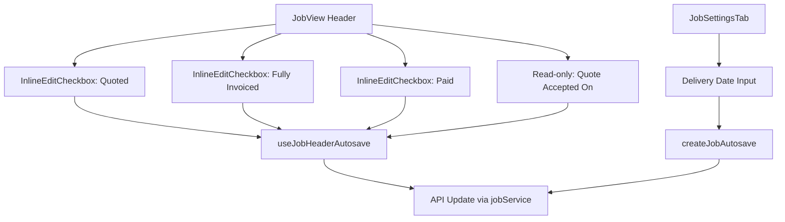

# Merge Job Tabs Architectural Plan

## Requirements

### Functional Requirements

- Merge the content from `JobWorkflowTab.vue` into `JobSettingsTab.vue` without losing any functionality, particularly the autosave mechanism.
- Move the Delivery Date field from `JobWorkflowTab.vue` to `JobSettingsTab.vue`, placing it under the Job Description field, and ensure autosave functions correctly for it.
- Relocate the three tracking flags (Already Quoted, Fully Invoiced, Job Paid) to the header in `JobView.vue`.
  - Display Already Quoted and Fully Invoiced conditionally: only if the job is quoted or invoiced.
  - Display Job Paid as a checkbox always visible, with automatic saving upon user modification.
- Move the "Quote Accepted On" field (read-only) to the header in `JobView.vue`, displayed conditionally.
- Preserve the existing capability to modify Job Status in the header; no alterations are required for it.
- Ensure all autosave functionality is maintained for the relocated fields.

### Non-Functional Requirements

- Maintain TypeScript type safety utilising schemas from `src/api/generated/api.ts`.
- Adhere to Vue 3 Composition API patterns with `<script setup>`.
- Ensure responsive design using Tailwind CSS.
- Employ British English for any new text, labels, or comments.
- Avoid breaking changes to existing functionality in other tabs or components.

## Architecture

### Component Structure

- **JobSettingsTab.vue**: Enhanced to incorporate the Delivery Date input field below the Description textarea. Integrate an autosave watcher for the new field. Remove any references to `JobWorkflowTab`.
- **JobView.vue**: Update the header section to include conditional rendering for the tracking flags and Quote Accepted On date. Utilise existing InlineEdit components or develop new ones for checkboxes and read-only display.
- **JobWorkflowTab.vue**: To be deleted following the merge.
- **JobViewTabs.vue**: Update to remove the Workflow tab, presuming it references `JobWorkflowTab`.

### Data Flow

- Local state in `JobSettingsTab`: Extend `localJobData` to include `delivery_date`. Add a watcher for autosave.
- In `JobView` header: Employ local reactive refs for flags (quoted, fully_invoiced, paid) and a computed property for conditional display. Extend the `useJobHeaderAutosave` composable to manage updates for these fields.
- Autosave Integration: Leverage `createJobAutosave` in tabs and `useJobHeaderAutosave` in the header. Ensure the `saveAdapter` encompasses the new fields in patches.
- Conditional Rendering: Utilise computed properties in `JobView` such as `shouldShowTrackingFlags` based on `jobData.quoted || jobData.fully_invoiced`, and `shouldShowQuoteAccepted` based on `jobData.quote_acceptance_date`.

### Autosave Mechanism

- For Delivery Date in `JobSettingsTab`: Add `@blur="handleBlurFlush"` and a watcher on `localJobData.delivery_date`.
- For Header Flags: Upon checkbox alteration, invoke a handler that queues the change in `headerAutosave`.
- Ensure `getSnapshot`, `applyOptimistic`, and `saveAdapter` in autosave instances include the new fields.

### Diagram

## Tasks

1. Update `JobSettingsTab.vue`: Add Delivery Date input under Description, with v-model on `localJobData.delivery_date`, `@blur` handler, and watcher for autosave. Update initialisation and snapshot to include `delivery_date`.
2. Extend `useJobHeaderAutosave` composable: Add handlers for `quoted`, `fully_invoiced`, `paid`, and `quote_acceptance_date` (read-only display).
3. Update `JobView.vue` header: Add conditional sections for the three flags using `InlineEditCheckbox`, and read-only for Quote Accepted On. Bind to local refs and handlers.
4. Update local reactive data and watchers in `JobView` for new fields.
5. Remove `JobWorkflowTab.vue` file and update `JobViewTabs.vue` to remove Workflow tab reference.
6. Update autosave snapshots and `saveAdapter` in both composables to include new fields if necessary.
7. Test: Verify autosave operates for Delivery Date, header checkboxes save automatically, conditional displays are accurate, and no regressions occur in existing fields.
