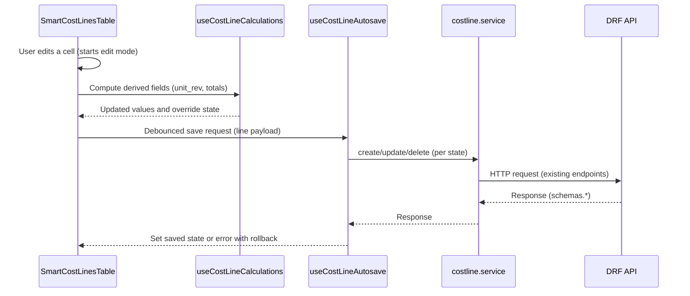
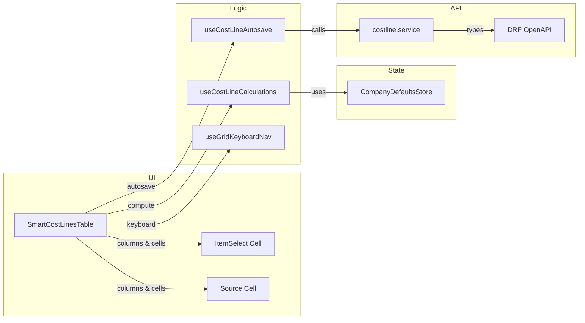

# SmartCostLinesTable — Architecture

Non‑negotiable standards

- Absolute rule: all implementation code and code comments must be written in English.
- Use only generated schemas/types from [api.ts](src/api/generated/api.ts:1). Never create local types/interfaces/schemas for backend data.
- Preserve current API contracts: use the same endpoints/payloads from [costline.service.ts](src/services/costline.service.ts:1).
- Frontend performs presentation-only calculations. Never move backend business rules to the frontend.

High-level component map

- [SmartCostLinesTable.vue](src/components/shared/SmartCostLinesTable.vue) — Smart DataTable presenting editable cost lines with spreadsheet UX, optional Item column, optional Source column, and per-line autosave.
- Composables:
  - [useCostLineCalculations()](src/composables/useCostLineCalculations.ts:1) — Centralizes line-kind rules, materials markup application, time rates from Company Defaults, totals and rounding, and unit_rev override behavior.
  - [useCostLineAutosave()](src/composables/useCostLineAutosave.ts:1) — Debounced optimistic autosave per line with rollback and retry; integrates with cost line service and accepts current payload shapes.
  - [useGridKeyboardNav()](src/composables/useGridKeyboardNav.ts:1) — Keyboard focus model, edit lifecycle controls, navigation and shortcuts mapping.
- Integrations:
  - Reuse [DataTable.vue](src/components/DataTable.vue:1) with custom column renderers (TanStack Vue Table).
  - Reuse [ItemSelect.vue](src/views/purchasing/ItemSelect.vue:1) inside the optional Item column.
  - Company Defaults via [useCompanyDefaultsStore](src/stores/companyDefaults.ts:1).
  - Cost line API via [costline.service.ts](src/services/costline.service.ts:1).

1. SmartCostLinesTable.vue responsibilities

- Present cost lines with base columns: kind, desc, quantity, unit_cost, unit_rev, total_cost (derived), total_rev (derived), and actions.
- Optional Item column with ItemSelect behavior (auto-fill desc/unit_cost and compute unit_rev for materials; disabled for time; allowed for adjustment).
- Optional Source column (read-only, clickable) for JobActualTab that preserves routing via parent-provided resolver or click callback.
- Inline edit lifecycle: view → edit (Enter/F2) → commit (Enter) or cancel (Esc) with validation and recalculation per-kind.
- Autosave per line with debounced optimistic updates, visual states (saving/saved/error), retry, and rollback on failure.
- Keyboard navigation and productivity shortcuts.
- Performance model that minimizes re-renders and isolates per-cell updates.

2. Data structures and typing

- Input/output data: use schemas from [api.ts](src/api/generated/api.ts:1), specifically:
  - schemas.CostLine (rendering, identity)
  - schemas.CostLineCreateUpdate (create payload)
  - schemas.PatchedCostLineCreateUpdate (update payload)
- UI-only state (not persisted):
  - isSaving: boolean
  - saveError: string | null
  - overriddenUnitRev: boolean (true when user manually set unit_rev)
  - focusToken: string (internal focus control when needed)
  - can_edit: boolean | undefined (UI-only flag)
  - can_delete: boolean | undefined (UI-only flag)

3. Column definitions and cell editors

- Base approach follows [PoLinesTable.vue](src/components/purchasing/PoLinesTable.vue:1):
  - Define computed columns array with id, header and cell renderer using h(...) to render inputs/selectors.
  - Keep leaf cells light; delegate complex logic to composables for purity and testability.
- Column set:
  - Type (kind): read-only badge with display mapping.
  - Description (desc): inline text editor (disabled for non-editable situations).
  - Quantity (quantity): numeric input editor; enforce validation per-kind before commit.
  - Unit Cost (unit_cost): editable for material/adjustment; read-only for time; auto-populate from Item when selected for material/adjustment.
  - Unit Revenue (unit_rev): default computed; editable only when kind is material/adjustment and when not frozen by time kind rules; manual override toggles overriddenUnitRev UI flag.
  - Total Cost (derived): read-only, frontend compute.
  - Total Revenue (derived): read-only, frontend compute.
  - Item (optional): renders [ItemSelect.vue](src/views/purchasing/ItemSelect.vue:1) for material/adjustment; disabled for time.
  - Source (optional): read-only clickable cell; uses parent-provided [sourceResolver()](src/components/shared/SmartCostLinesTable.vue:1) or [sourceClick()](src/components/shared/SmartCostLinesTable.vue:1).
  - Actions: Delete (and possibly duplicate/move when implemented).
- Rendering:
  - Use [DataTable.vue](src/components/DataTable.vue:1) with large page-size (e.g., 1000) similar to PoLinesTable to keep scroll smooth until virtualization is introduced or confirmed available.

4. Composables

4.1 [useCostLineCalculations()](src/composables/useCostLineCalculations.ts:1)

- Inputs:
  - companyDefaults: readonly reference from [useCompanyDefaultsStore](src/stores/companyDefaults.ts:1) (must be loaded before edit operations; UI should show loading state if not loaded).
  - current line (schemas.CostLine) and lightweight UI meta (overriddenUnitRev).
- Responsibilities:
  - Material:
    - unit_rev default = unit_cost × (1 + materials_markup).
    - If overriddenUnitRev is true, keep user-set unit_rev until item or kind changes; then clear the flag and recompute.
  - Time:
    - unit_cost = wage_rate from Company Defaults.
    - unit_rev = charge_out_rate from Company Defaults.
    - Both read-only in UI; recompute totals when quantity changes.
  - Adjustment:
    - Free-form: allow zero/negative quantity and costs; compute totals accordingly.
  - Totals:
    - total_cost = quantity × unit_cost
    - total_rev = quantity × unit_rev
    - Round to two decimals using app locale; avoid mutation of source objects directly in calculation helpers; return new values or patch instructions.
- Triggers and recalculation events:

  - On Item change (material/adjustment): prefill desc and unit_cost; recompute unit_rev unless overriddenUnitRev is true; if type changed to/from time, clear unit_rev override and recompute.
  - On Quantity change: recompute totals (all kinds).
  - On Unit Cost change (material/adjustment): recompute default unit_rev unless overriddenUnitRev; recompute totals.
  - On Unit Rev manual change: set overriddenUnitRev = true; recompute totals.
  - On Kind change: re-apply respective rules; for time, lock unit_cost/unit_rev to defaults from Company Defaults.

    4.2 [useCostLineAutosave()](src/composables/useCostLineAutosave.ts:1)

- Inputs: debounceMs, service methods (injected or imported), current line data and a shallow snapshot for rollback.
- Integration:
  - Create: [createCostLine](src/services/costline.service.ts:29) with schemas.CostLineCreateUpdate; for kind actual use the specific endpoint; for estimate/quote use the variant with kind param.
  - Update: [updateCostLine](src/services/costline.service.ts:45) with schemas.PatchedCostLineCreateUpdate (partial).
  - Delete: [deleteCostLine](src/services/costline.service.ts:54).
- Behavior:

  - Optimistic path: update UI first (including totals) and set isSaving true; enqueue debounced save; set saved state or error state.
  - Rollback on error: restore previous snapshot, set saveError, expose retry(fn) that reuses last payload.
  - Triggers: onBlur per-cell and onCommit (Enter) per-cell/row.
  - Identity handling: if the line had no id, on successful create replace temp identity with backend id.

    4.3 [useGridKeyboardNav()](src/composables/useGridKeyboardNav.ts:1)

- Responsibilities:
  - Manage entry/exit edit mode: Enter/F2 to edit; Enter to commit; Esc to cancel.
  - Cell navigation: Tab/Shift+Tab to move across editable cells; Arrow keys to move row focus; maintain column position when possible.
  - Line operations: Ctrl/Cmd+Enter add new below (respecting tabKind restrictions), Ctrl/Cmd+D duplicate, Ctrl/Cmd+Backspace delete, Alt+Up/Alt+Down move row when supported.
  - Focus recovery after create/delete/move: preserve “next best” focus based on prior position and availability.
- Implementation notes:
  - Encapsulate event bindings and return handlers to be wired in cell wrappers.
  - Ensure no global listeners leak; cleanup on unmount.

5. Data flow

Sequence diagram

Component data lifecycle

- Input list: parent provides CostLine[]; Smart component may keep a reactive copy for local UI-state augmentation (e.g., isSaving, overriddenUnitRev) without mutating backend fields.
- On any edit:
  - Validate per-kind.
  - Compute derived values via [useCostLineCalculations()](src/composables/useCostLineCalculations.ts:1).
  - Update UI with optimistic patch.
  - Call [useCostLineAutosave()](src/composables/useCostLineAutosave.ts:1) to persist changes.
- On save success: ensure authoritative fields reflect backend response; never strip or rename backend schema fields.
- On save error: rollback and show discreet toast + per-line error; keep focus if possible.

6. Company Defaults integration

- Access via [useCompanyDefaultsStore](src/stores/companyDefaults.ts:1).
- Required fields:
  - materials_markup for material/adjustment unit_rev default.
  - wage_rate and charge_out_rate for time.
- Contract:
  - Smart grid must only enable editing once Company Defaults are loaded; otherwise present a loading state/disabled editors.
  - No hardcoded defaults; never use fallback values for our own data per project rules.

7. Source column design (JobActualTab)

- Visible only when showSourceColumn and tabKind = actual.
- Read-only label with clickable action:
  - Parent can pass [sourceResolver()](src/components/shared/SmartCostLinesTable.vue:1) returning { label, onClick } based on the line’s meta or external references.
  - Alternatively, parent can pass [sourceClick()](src/components/shared/SmartCostLinesTable.vue:1) and the component renders a standard label resolved by parent.
- Routing:
  - onClick must use existing app routing; the component must not assume routes.
- Never editable; excluded from keyboard edit cycle.

8. Validation rules

- quantity:
  - material/time: required and greater than 0.
  - adjustment: can be 0 or negative.
- Editability:
  - time: unit_cost and unit_rev are not editable; computed from Company Defaults.
  - material/adjustment: unit_rev is editable; if user edits, set overriddenUnitRev = true and stop auto-recalc until item or kind changes.
- Tab restrictions:
  - estimate/quote: allow add/delete of all kinds.
  - actual: allow only add adjustment; show tooltip for disabled kinds.

9. Keyboard shortcuts (grid-level)

- Enter/F2: start editing focused cell.
- Enter: commit edit (apply calculations and trigger autosave).
- Esc: cancel edit.
- Tab/Shift+Tab: move to next/previous editable cell.
- Arrow keys: move row focus while keeping column if possible.
- Ctrl/Cmd+Enter: add line below (respect tabKind restrictions).
- Ctrl/Cmd+D: duplicate line.
- Ctrl/Cmd+Backspace: delete line.
- Alt+Up / Alt+Down: move line (when ordering is supported by parent).
- Display a concise hint bar above the table listing the key shortcuts.

10. Performance considerations

- Reuse [DataTable.vue](src/components/DataTable.vue:1) and the ColumnDef pattern with small cell renderers.
- Avoid heavy watchers on the whole dataset; operate per-row/per-cell.
- Debounce autosave operations per line; cancel pending saves when the same field changes again.
- Keep derived computations pure and memoized where helpful; avoid expensive formatting in render loops (extract helpers).
- If virtualization is supported by DataTable: enable; otherwise keep large page size with efficient rendering similar to [PoLinesTable.vue](src/components/purchasing/PoLinesTable.vue:1).

11. API integration and payloads

- Create:
  - For actual: [createCostLine](src/services/costline.service.ts:29) route with job_id param (actual path).
  - For estimate/quote: [createCostLine](src/services/costline.service.ts:29) route with job_id and kind param.
  - Payload: schemas.CostLineCreateUpdate only.
- Update:
  - [updateCostLine](src/services/costline.service.ts:45) using schemas.PatchedCostLineCreateUpdate.
- Delete:
  - [deleteCostLine](src/services/costline.service.ts:54).
- No schema workarounds; never add ad-hoc fields to payloads. UI-only flags are kept locally.

12. Error handling and UX

- Visual feedback:
  - Per-line states: saving (spinner or subtle indicator), saved (checkmark), error (icon + tooltip).
  - Toasts: concise, not intrusive; follow project rules ([08-error-handling.md](.kilocode/rules/08-error-handling.md)).
- Console logs:
  - Development-friendly logs; do not log sensitive data.
- Retry:
  - Expose per-line retry action that reuses last payload and preserves focus.

13. Accessibility

- Ensure focus outline and predictable tab order.
- Read-only cells should not enter edit mode; provide aria-readonly where appropriate.
- Clickable Source labels must be keyboard accessible (e.g., role and tabindex as needed).

14. Migration notes

- Introduce [SmartCostLinesTable.vue](src/components/shared/SmartCostLinesTable.vue) alongside the existing [CostLinesGrid.vue](src/components/shared/CostLinesGrid.vue:1).
- Migrate:
  - [JobEstimateTab.vue](src/components/job/JobEstimateTab.vue:1) — replace grid, enable full set (Item column on, Source off).
  - [JobQuoteTab.vue](src/components/job/JobQuoteTab.vue:1) — replace grid, enable full set (Item column on, Source off).
  - [JobActualTab.vue](src/components/job/JobActualTab.vue:1) — replace grid, restrict additions to adjustment, show Source column.
- Keep service integrations unchanged; do not change stores or endpoints.

Appendix — Mermaid component diagram

References

- Base table pattern: [DataTable.vue](src/components/DataTable.vue:1)
- Purchase order table example: [PoLinesTable.vue](src/components/purchasing/PoLinesTable.vue:1)
- Current read-only grid: [CostLinesGrid.vue](src/components/shared/CostLinesGrid.vue:1)
- Company Defaults store: [companyDefaults.ts](src/stores/companyDefaults.ts:1)
- Cost line services: [costline.service.ts](src/services/costline.service.ts:1)
- Generated API schemas: [api.ts](src/api/generated/api.ts:1)
- Project rules index: [.kilocode/rules/README.md](.kilocode/rules/README.md)
