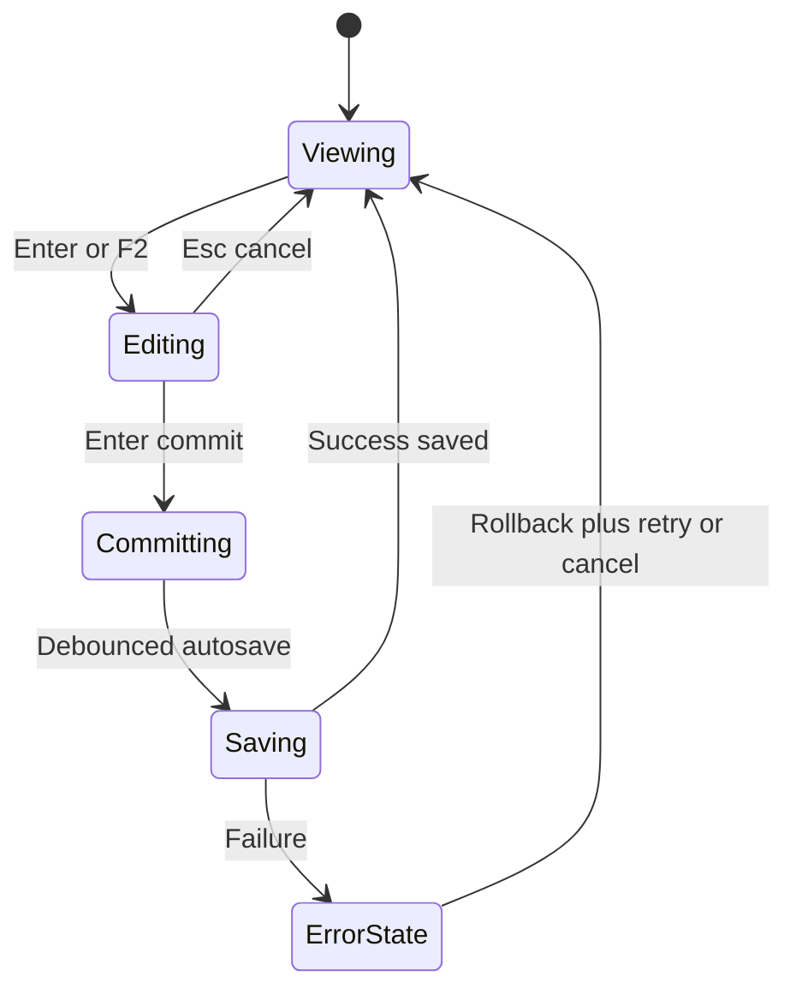

# SmartCostLinesTable — Executable Plan and Checklists

Non‑negotiable standards

- Absolute rule: all implementation code and code comments must be written in English.
- Use only generated schemas/types from [api.ts](src/api/generated/api.ts). Never create local types for backend data.
- Preserve current API contracts in [costline.service.ts](src/services/costline.service.ts:1) for create, update and delete.
- Frontend performs presentation-only calculations.

Global constraints

- No schema changes; use the payloads already accepted by:
  - [createCostLine()](src/services/costline.service.ts:29)
  - [updateCostLine()](src/services/costline.service.ts:45)
  - [deleteCostLine()](src/services/costline.service.ts:54)
- Only use types from generated [api.ts](src/api/generated/api.ts).

High-level execution checklist

- [ ] Create [SmartCostLinesTable.vue](src/components/shared/SmartCostLinesTable.vue) with column definitions, inline editors, autosave states and shortcuts hint
- [ ] Implement composable [useCostLineCalculations()](src/composables/useCostLineCalculations.ts:1)
- [ ] Implement composable [useCostLineAutosave()](src/composables/useCostLineAutosave.ts:1)
- [ ] Implement composable [useGridKeyboardNav()](src/composables/useGridKeyboardNav.ts:1)
- [ ] Integrate Item column using [ItemSelect.vue](src/views/purchasing/ItemSelect.vue)
- [ ] Implement optional Source column for JobActualTab with resolver and click callback
- [ ] Migrate [JobEstimateTab.vue](src/components/job/JobEstimateTab.vue) to [SmartCostLinesTable.vue](src/components/shared/SmartCostLinesTable.vue)
- [ ] Migrate [JobQuoteTab.vue](src/components/job/JobQuoteTab.vue) to [SmartCostLinesTable.vue](src/components/shared/SmartCostLinesTable.vue)
- [ ] Migrate [JobActualTab.vue](src/components/job/JobActualTab.vue) to [SmartCostLinesTable.vue](src/components/shared/SmartCostLinesTable.vue) with restrictions and Source column
- [ ] Implement validations and overrides behavior
- [ ] Implement keyboard shortcuts and focus persistence
- [ ] Validate performance and re-render isolation
- [ ] Manual test pass and acceptance criteria validation

Component contract (to implement)

- Props
  - data: CostLine[] (from generated [api.ts](src/api/generated/api.ts))
  - can_edit?: boolean (UI-only)
  - can_delete?: boolean (UI-only)
  - showItemColumn?: boolean = true
  - showSourceColumn?: boolean = false
  - tabKind: 'estimate' | 'quote' | 'actual'
  - debounceMs?: number = 600
- Emits / callbacks
  - addLine(kind)
  - deleteLine(lineId | index)
  - duplicateLine(line)
  - moveLine(index, direction)
  - sourceClick(line) or sourceResolver(line) → { label, onClick }

Step-by-step implementation guide

A) Composables

1. [useCostLineCalculations()](src/composables/useCostLineCalculations.ts:1)

- Inputs: company defaults from [useCompanyDefaultsStore](src/stores/companyDefaults.ts:1), current line data, override flags.
- Responsibilities:
  - Material: default unit_rev = unit_cost × (1 + materials_markup); support manual override that freezes recalculation until item/type changes.
  - Time: unit_cost = wage_rate; unit_rev = charge_out_rate; both read-only; totals update on quantity changes.
  - Adjustment: free edits; support zero/negative values.
  - Totals: total_cost = quantity × unit_cost; total_revenue = quantity × unit_rev; round to 2 decimals.
- Outputs: helpers returning computed patches to apply for UI and autosave.

2. [useCostLineAutosave()](src/composables/useCostLineAutosave.ts:1)

- Inputs: debounceMs, current line+snapshot, service adapters to:
  - [createCostLine()](src/services/costline.service.ts:29)
  - [updateCostLine()](src/services/costline.service.ts:45)
  - [deleteCostLine()](src/services/costline.service.ts:54)
- Behavior:
  - Debounce changes per line; optimistic update; set isSaving; finalize as saved or rollback on error and set saveError.
  - Identity promotion: when creating a new line, replace temporary local identity with API id.

3. [useGridKeyboardNav()](src/composables/useGridKeyboardNav.ts:1)

- Map shortcuts: Enter/F2 edit, Enter commit, Esc cancel, Tab/Shift+Tab move, Arrows move row focus, Ctrl/Cmd+Enter add below, Ctrl/Cmd+D duplicate, Ctrl/Cmd+Backspace delete, Alt+Up/Alt+Down move row.
- Provide handlers to be bound per-cell and per-row; ensure cleanup on unmount.

B) SmartCostLinesTable.vue

1. Base structure

- Use [DataTable.vue](src/components/DataTable.vue:1) and define columns via computed array following the pattern from [PoLinesTable.vue](src/components/purchasing/PoLinesTable.vue:1).
- Renderers per column with h(...) for inputs/selects; keep logic in composables.

2. Columns

- Type (kind): read-only badge, kind → label mapping.
- Description (desc): text input; editable by kind rules.
- Quantity (quantity): number input; validate per kind.
- Unit Cost (unit_cost): editable for material/adjustment; read-only for time.
- Unit Revenue (unit_rev): computed by default; editable with override for material/adjustment; read-only for time.
- Total Cost and Total Revenue: read-only derived values.
- Item (optional): reuses [ItemSelect.vue](src/views/purchasing/ItemSelect.vue); disabled for time; for material/adjustment, prefill desc and unit_cost, and compute unit_rev per materials_markup with override respected.
- Source (optional): visible only when tabKind is actual; read-only clickable; resolved with sourceResolver or handled by sourceClick; preserves existing app routing.
- Actions: delete (and optional duplicate/move if parent provides).

3. Autosave states

- Visual indicators per line: saving, saved, error.
- Retry action on error that reuses last payload.
- On rollback, restore previous values and keep focus.

4. Validations

- quantity:
  - material/time: required and > 0
  - adjustment: can be 0 or negative
- Non-editable fields enforced by kind.
- unit_rev override respected until item or kind changes.

5. Keyboard and focus

- Implement shortcut handlers from [useGridKeyboardNav()](src/composables/useGridKeyboardNav.ts:1).
- Ensure consistent focus after create/duplicate/move/delete.

C) Migrations

1. [JobEstimateTab.vue](src/components/job/JobEstimateTab.vue)

- Replace [CostLinesGrid.vue](src/components/shared/CostLinesGrid.vue) with [SmartCostLinesTable.vue](src/components/shared/SmartCostLinesTable.vue).
- Props:
  - data = existing CostLine list
  - showItemColumn = true
  - showSourceColumn = false
  - tabKind = 'estimate'
- Wire addLine, deleteLine, duplicateLine, moveLine; forward persistence to [costline.service.ts](src/services/costline.service.ts:1).
- Remove old modal edit paths specific to grid, or keep temporarily if still needed during phased migration.

2. [JobQuoteTab.vue](src/components/job/JobQuoteTab.vue)

- Same as Estimate with tabKind = 'quote'.
- Ensure Item column on; Source column off.

3. [JobActualTab.vue](src/components/job/JobActualTab.vue)

- Replace grid and set:
  - tabKind = 'actual'
  - showItemColumn = true
  - showSourceColumn = true
- Restrict additions to 'adjust' only; disable other kinds with tooltip.
- Provide sourceResolver(line) to map to existing navigation targets.

D) Manual tests

Data editing and calculations

- Material: edit unit_cost and see unit_rev computed with materials_markup; override unit_rev and verify freeze across further unit_cost edits; clear freeze after changing item or kind.
- Time: change quantity and verify totals; ensure unit_cost/unit_rev are from Company Defaults and read-only.
- Adjustment: allow zero or negative quantity and costs; totals computed correctly.

Item selection

- Material/Adjustment: selecting an item pre-fills desc and unit_cost; unit_rev computed; override still respected.
- Time: item selection disabled.

Autosave

- OnBlur and Enter commit trigger autosave; debounce within 400–800ms; visual states show saving/saved.
- Force an error and verify rollback, error indicator and retry resumes from last payload; focus preserved.

Keyboard navigation

- Verify Enter, F2, Esc, Tab, Shift+Tab, Arrow keys, Ctrl/Cmd+Enter, Ctrl/Cmd+D, Ctrl/Cmd+Backspace, Alt+Up/Alt+Down work as specified.
- Focus remains consistent after create/duplicate/delete/move.

JobActualTab specifics

- Only 'adjust' kind can be added; other kinds disabled with tooltip.
- Source column is visible, read-only and clickable; clicking navigates to correct app route as provided by resolver.

Performance

- Scrolling remains smooth with large datasets (align to [DataTable.vue](src/components/DataTable.vue:1) behavior).
- Re-renders are localized to edited cells/rows.

E) Acceptance criteria

- Inline edit spreadsheet UX implemented exactly per kind rules.
- Autosave is optimistic, debounced, with saving/saved/error states and working rollback + retry.
- Item column behavior mirrors [ItemSelect.vue](src/views/purchasing/ItemSelect.vue) semantics.
- unit_rev override respected until type or item changes.
- JobActualTab enforces 'adjust'-only adds; Source column works and is non-editable.
- Totals always correct and rounded to 2 decimals using app locale.
- API integration uses only existing endpoints in [costline.service.ts](src/services/costline.service.ts:1) with generated types from [api.ts](src/api/generated/api.ts).
- No regressions introduced on [PoLinesTable.vue](src/components/purchasing/PoLinesTable.vue).

F) Risk controls and guardrails

- Do not add any backend-like fields to payloads; keep UI-only flags in local state only.
- Block editing when Company Defaults are not loaded.
- Never introduce fallbacks for our own data; rely on store values for defaults.

G) Edit lifecycle state flow

H) Out of scope for this implementation

- Any backend schema or endpoint changes.
- Real-time updates beyond current autosave model.
- AG Grid adoption; continue using current [DataTable.vue](src/components/DataTable.vue:1) foundation.
